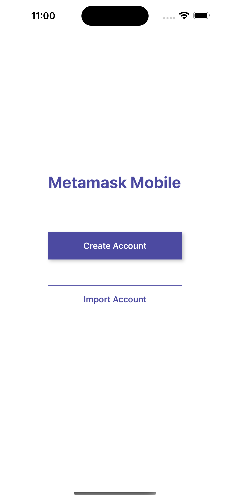
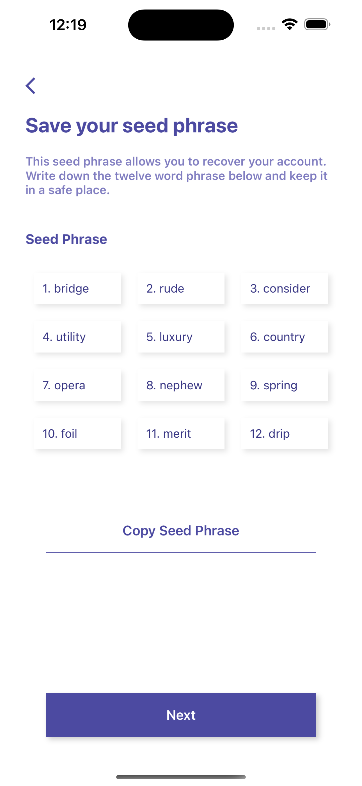
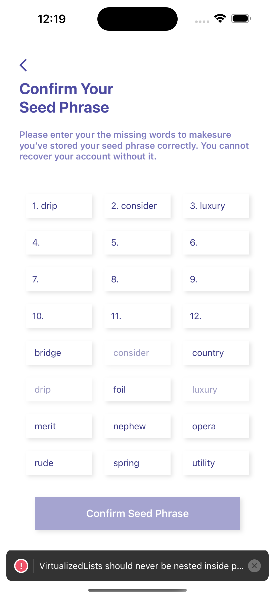
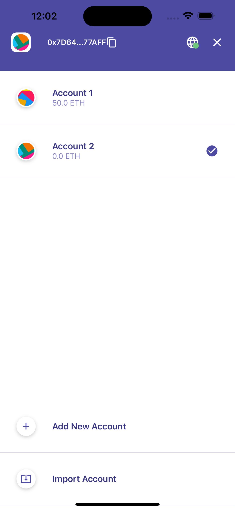
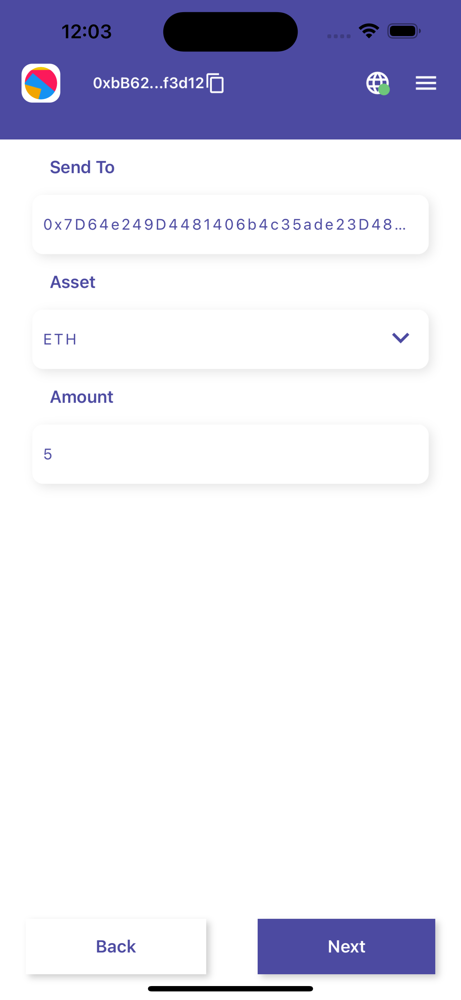
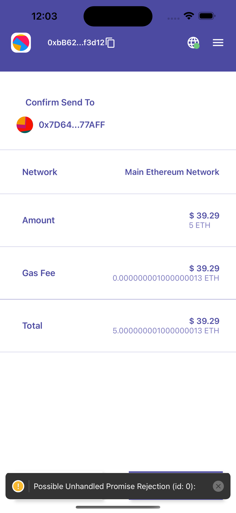
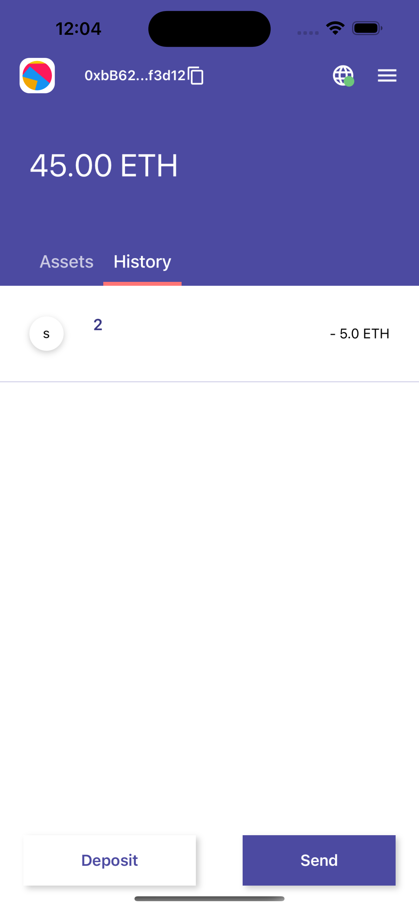

# Crypto Wallet
This is a metamask mobile app clone created with react native and hardhat.

## Features
This app can perform task like : 
- creation of a wallet
- import a old wallet with private key
- send and receive token over local blockchain
- add new accounts in a wallet
- add tokens other than ethereum and swap them

## How to run
1. install required packages, in blockchain and client folder run `yarn install`
2. start the local blockchain
    ```
    cd blockchain
    yarn hardhat node
    ```
3. run the react native app
    ```
    cd client
    yarn start
    ```
4. create a new wallet with seed phrase.
5. add eth to account
    ```
    cd blockchain
    yarn hardhat sendEth --address <address> --amount <amount in eth>
    ```
6. Now use that address to send eth and token from the app.

## Screenshots

<div style="display:flex; justify:between"> 







</div>
